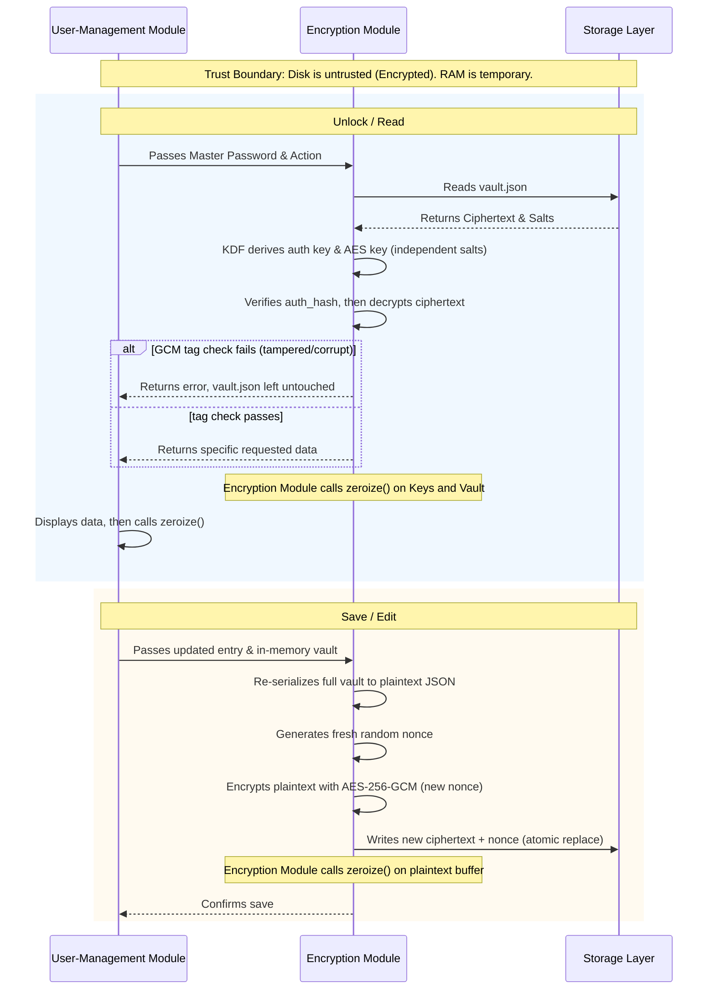

# SecureVault: Architecture & Design Document

## 1. Implementation Language & Libraries
The application is written in **Rust**. Rust's native memory safety, strict type system, and ownership model prevent common C/C++ vulnerabilities like buffer overflows and dangling pointers natively at compile time.

**Proposed Libraries:**
- `inquire`: For interactive terminal menus and masked password prompting.
- `argon2`: For memory-hard key derivation and password hashing.
- `aes-gcm`: For authenticated encryption of the data payload.
- `zeroize`: To explicitly wipe sensitive variables from memory after use.
- `serde` / `serde_json`: For serializing the vault structures to JSON.

## 2. Architecture & Data Flow
The system implements a strict Privilege Separation pattern, divided into three core modules. The application acts as a stateless executor, ensuring sensitive data is only held in memory (RAM) for the absolute minimum time required.

- **User-Management Module (Frontend):** Handles master password entry, verifies authentication, and manages the interactive UI.
- **Encryption Module (Core):** Derives keys via the KDF, decrypts/encrypts the payload, and performs explicit memory wiping.
- **Storage Layer:** Handles reading and writing the encrypted JSON vault to the local disk.

### Per-User Isolation
Each OS user account gets its own vault file (e.g. stored under that user's home/config directory, not a shared system-wide path). The application never reads or writes another user's vault, and file permissions on the vault should restrict access to its owner. This keeps one local account's credentials from being reachable by another account on the same machine.

### Data Flow & Trust Boundaries

Every write re-encrypts the entire vault as one block and generates a brand-new random nonce — a nonce is never reused with the same AES key. The write is an atomic replace (write to a temp file, then rename) so a crash mid-write cannot leave a corrupted vault.json in place of the last good version.

## 3. Cryptographic Scheme & Vault Format

### Cryptographic Decisions
- **Key Derivation (Argon2id):** Chosen over PBKDF2 or bcrypt because Argon2id provides superior resistance to GPU and ASIC cracking by enforcing high memory hardness alongside time costs.
- **Two independent derivations, not one shared key:** The master password is run through Argon2id twice, once with `auth_salt` to produce `auth_hash` (used only to verify the password) and once with `crypto_salt` to produce the AES key (used only to encrypt/decrypt data). Using separate salts means the stored `auth_hash` reveals nothing about the encryption key, and compromising one derivation doesn't compromise the other.
- **Encryption (AES-256-GCM):** Chosen because it is an Authenticated Encryption with Associated Data (AEAD) cipher. It ensures confidentiality while simultaneously providing a cryptographic tag to guarantee the vault has not been tampered with on disk.

### Vault Format
The storage layer utilizes an encrypted flat-file format structured as JSON. To prevent metadata leakage, the entire inner payload (service names, usernames, passwords) is encrypted as a single block.

The schema (`vault.json`) contains base64-encoded strings:
- `auth_salt`: Used to verify the master password.
- `auth_hash`: The hashed master password.
- `crypto_salt`: Used to derive the AES encryption key.
- `nonce`: The unique initialization vector for AES-GCM, regenerated on every write.
- `ciphertext`: The encrypted payload containing the actual credentials.

### Failure Behavior
If the AES-GCM tag check fails (wrong password derivation, corruption, or tampering), decryption is aborted, no plaintext is returned to the UI layer, and `vault.json` on disk is left completely unmodified. The user sees a generic "unable to unlock vault" error, and the application does not distinguish "wrong password" from "corrupted/tampered file" in its messaging, to avoid leaking which case occurred.

## 4. Threat Model

| Threat Area | Identified Threat | Intended Mitigation |
| :--- | :--- | :--- |
| **Master Password** | Dictionary or brute-force attacks against the master password. | Mitigated by using Argon2id with a high memory and time cost, making offline cracking computationally prohibitive. |
| **Vault at Rest** | Unauthorized file access, theft, or physical tampering of the storage file. | Mitigated by AES-256-GCM authenticated encryption. Tampering causes the GCM tag check to fail, aborting execution and leaving the on-disk file unchanged. |
| **Vault in Memory** | Memory scraping, cold boot attacks, or accidental leaks in application state. | Mitigated by a stateless architecture and the `zeroize` crate, which explicitly wipes plaintext keys and passwords from RAM immediately after use. |
| **Cross-Account Access** | One local OS user reading another local user's saved credentials. | Mitigated by per-user vault file isolation and restrictive file permissions (owner-only) on the vault path. |
| **Nonce Reuse** | Reusing an AES-GCM nonce with the same key, which breaks confidentiality and authenticity. | Mitigated by generating a fresh random nonce on every write, since the whole vault is re-encrypted as one block per save. |
| **Interface** | Keylogging via terminal history files (`.bash_history`) or shoulder surfing. | Mitigated by the `inquire` crate, which masks password prompts and rejects passing credentials via command-line arguments. |
